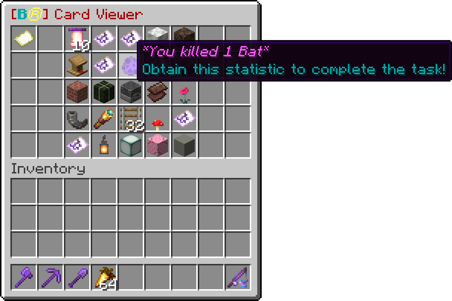

# BingoReloaded
## Minecraft Bingo 1.18+ Plug-In

A Minecraft 1.18/1.19/1.20+ Spigot Plugin, take a look at the card viewer!

## Key Features
- Play 3 different gamemodes
  - Regular
  - Lockout
  - Complete-all / Blackout
- Select between 4 premade kits and 5 custom kits.
  - Hardcore
  - Normal
  - Overpowered
  - Reloaded
- Give all players passive effects such as water breathing and speed
- Different card sizes for shorter or longer games
- Choose between 16 premade teams and/or create even more teams 
- Play to collect items, achieve advancements and complete statistic goals 
- Different tasks for every game, the game will choose between a list of over 220 tasks
- Create your own cards using the card creator in-game
- Vote for options before the game starts
- All settings can be configured using the `/autobingo` commands, click [here](https://github.com/Steaf23/BingoReloaded/blob/main/AutoBingo.md) for more information
- All messages can be translated, click [here](https://github.com/Steaf23/BingoReloaded/blob/main/translations.md) for more information

## Overview
This plugin is written for Minecraft version 1.18 and up!

At this moment the plugin works best on small and private servers.

I created a Discord server where you can post your concerns or requests, join it here!

Players can join the game by selecting a team using the team selection item.
Players can also vote for certain game settings using the vote item.

Admins can start a bingo game manually using the `/bingo` command as well as change other settings.
Otherwise a game will start once enough players have joined a team (4 by default).

If during the game your Bingo card has been lost, use `/bingo getcard` to get it back! When you obtain the right items the task should be completed immediately. If this is not the case you can complete items from the card by throwing them out of your inventory (using q when holding an item or dragging them with the mouse outside of the inventory slots).

# // THIS PAGE IS STILL UNDER CONSTRUCTION //

## Features

### Bingo Menu:
As a bingo admin, open the settings menu using `/bingo`. This menu can be used to change all settings that will apply to the next game to be played.
### 3 Different gamemodes:
- **Regular**. This is the bingo everyone knows about. Be the first to complete 1 line going horizontally, vertically or diagonally to win the game!
- **Lockout**. Be the first to complete the majority of the card to win. But there is a catch, items that other teams have gathered cannot be used again!
- **Complete-All**. Be the first one to complete all items on the card. Complete-all games can be pretty long if you have made a hard card!
### Choose between 4 pre-made kits:
- Hardcore
### Create your own kits:
- an admin can create a kit by using the `/bingo kits`

If you want to make suggestions, have questions or just want to hang out, be sure to join the discord server [here](https://discord.gg/AzZNxPRNPf)!